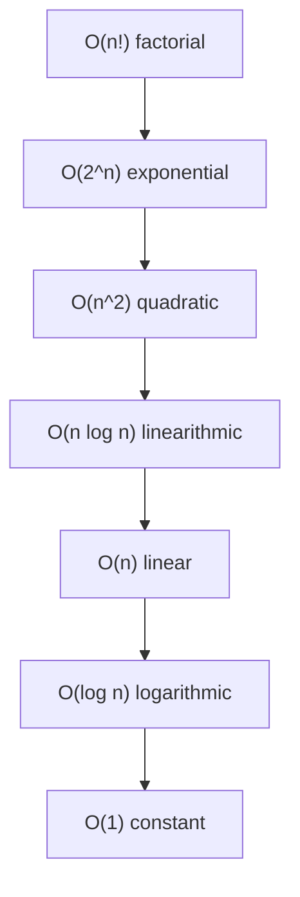

# Big O notation — study guide

**Big O** describes an **asymptotic upper bound**: how the **amount of work** (steps, memory) grows as the input size **n** gets large. We **drop constant factors** and **lower-order terms**, because for huge **n** the dominant term wins.

You will see Big O used for **time complexity** (number of steps) and **space complexity** (extra memory). The notation is the same; only what you count changes.

**Big O vs Big Θ:** **O** means “grows *at most* like this.” **Θ** (theta) means “grows *exactly* like this” (tight bound). If an algorithm is Θ(n), it is also O(n), but saying O(n²) is still a valid (loose) upper bound. Interview notes usually mean a **sensible tight** bound when they say “the complexity is O(n).”

## Growth from worst to best (typical ranking)

For large **n**, slower-growing runtimes are better. Ordered from **explodes fastest** to **barely grows**:



Rough intuition when **n doubles**:

| If complexity is… | Doubling n roughly… |
|-------------------|---------------------|
| O(1) | unchanged |
| O(log n) | adds a **fixed** number of steps |
| O(n) | **doubles** work |
| O(n log n) | a bit more than doubles |
| O(n²) | **quadruples** work |
| O(2ⁿ) | **squares** the work (or worse) |
| O(n!) | astronomically worse |

---

## O(n!) — factorial

**Intuition:** You try **every ordering** or **every arrangement** of **n** distinct things; the count of permutations is **n!**.

**When you see it:** Brute-force traveling salesman (try all city orders), generating **all** permutations with no pruning.

**Example** — all permutations of an array (conceptually **n!** recursive calls in the worst tree):

```javascript
function permutations(arr) {
  if (arr.length <= 1) return [arr.slice()];
  const result = [];
  for (let i = 0; i < arr.length; i++) {
    const rest = arr.filter((_, j) => j !== i);
    for (const p of permutations(rest)) {
      result.push([arr[i], ...p]);
    }
  }
  return result;
}
```

---

## O(2ⁿ) — exponential

**Intuition:** Each step **branches** into multiple subproblems of nearly the same size (often **include / exclude**), so the work is **roughly multiplied** per element.

**When you see it:** All subsets (each item in or out), brute-force subset sum without memoization, naive recursive Fibonacci (time grows like **φⁿ**, golden ratio — still **exponential**, not literally **2ⁿ**).

**Example** — enumerate all subsets (exactly **2ⁿ** subsets):

```javascript
function allSubsets(arr) {
  const out = [];
  function build(i, current) {
    if (i === arr.length) {
      out.push(current.slice());
      return;
    }
    build(i + 1, current); // exclude arr[i]
    current.push(arr[i]);
    build(i + 1, current); // include arr[i]
    current.pop();
  }
  build(0, []);
  return out;
}
```

---

## O(n²) — quadratic

**Intuition:** Often **two nested loops** both driven by **n**, or compare **every pair**.

**When you see it:** Bubble / selection / insertion sort (worst or typical cases), naive “is this valid?” checks over all pairs.

**Example** — print every pair of indices:

```javascript
function allPairs(n) {
  for (let i = 0; i < n; i++) {
    for (let j = 0; j < n; j++) {
      // O(1) work → total O(n^2)
    }
  }
}
```

---

## O(n log n) — linearithmic

**Intuition:** **O(log n)** **levels** or **passes**, each doing **O(n)** work (divide-and-conquer sorts, balanced merges).

**When you see it:** Merge sort, heap sort; many efficient algorithms that **split** the problem in half repeatedly.

**Not** every sort: bubble sort is **O(n²)** in the worst case.

**Example** — merge sort outline (array split in half each recursion):

```javascript
function mergeSort(arr) {
  if (arr.length <= 1) return arr;
  const mid = Math.floor(arr.length / 2);
  const left = mergeSort(arr.slice(0, mid));
  const right = mergeSort(arr.slice(mid));
  return merge(left, right); // merge is O(n)
}
// Depth O(log n), O(n) per level → O(n log n)
```

---

## O(n) — linear

**Intuition:** **One** main pass over the data, **constant work per element**.

**When you see it:** Single loop, find max in unsorted array, copy array.

**Example:**

```javascript
function sum(arr) {
  let total = 0;
  for (let i = 0; i < arr.length; i++) total += arr[i];
  return total;
}
```

---

## O(log n) — logarithmic

**Intuition:** **n** is **halved** (or reduced by a constant factor) each step → number of steps ≈ **log₂ n**.

**When you see it:** Binary search on a **sorted** array, balanced BST height.

**Example** — binary search:

```javascript
function binarySearch(sorted, target) {
  let lo = 0;
  let hi = sorted.length - 1;
  while (lo <= hi) {
    const mid = Math.floor((lo + hi) / 2);
    if (sorted[mid] === target) return mid;
    if (sorted[mid] < target) lo = mid + 1;
    else hi = mid - 1;
  }
  return -1;
}
```

---

## O(1) — constant

**Intuition:** Work does **not** grow with **n** (bounded operations).

**When you see it:** Index into array, hash map get/set **average case**, push/pop end of dynamic array.

**Example:**

```javascript
function first(arr) {
  return arr[0];
}
```

---

## Quick reference

| Notation | Name | Typical examples | Pattern to spot |
|----------|------|------------------|-----------------|
| O(n!) | Factorial | All permutations, brute TSP | “every order of n items” |
| O(2ⁿ) | Exponential | All subsets, naive recursion with branching | “double counting / include-exclude tree” |
| O(n²) | Quadratic | Naive sorts, all pairs | nested `for` on n |
| O(n log n) | Linearithmic | Merge sort, heap sort | divide by 2 + O(n) combine per level |
| O(n) | Linear | One scan, find max | single loop over n |
| O(log n) | Logarithmic | Binary search | halve search space each step |
| O(1) | Constant | Array index, map get (avg.) | fixed steps, no n-sized loop |

---

## How to derive Big O (checklist)

1. **Nested loops** — if an outer loop runs **n** times and an inner loop runs **n** times per outer iteration, multiply → often **O(n²)** (unless inner bound shrinks in a special way).
2. **Sequential steps** — **add** the complexities, then **keep only the largest** growth (e.g. O(n) + O(n²) → **O(n²)**).
3. **Halving each step** — **O(log n)** levels (binary search, divide midpoint).
4. **O(n) work per level × O(log n) levels** — typical **O(n log n)** merge-style recursion.
5. **Recursion trees** — multiply branching factor by **depth**; watch for **overlapping** subproblems (memoization can drop exponential to polynomial).
